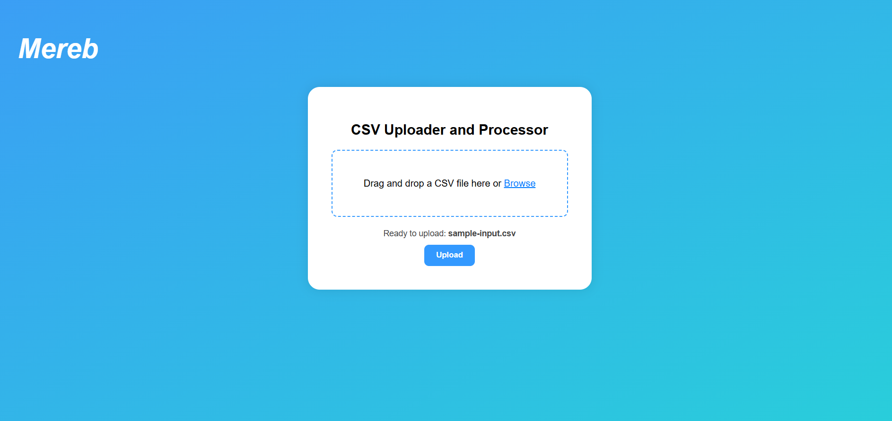

# CSV Sales Aggregator

This is a Node.js + React app that processes large CSV files containing departmental sales data. It aggregates total sales per department and returns a downloadable processed CSV.

---

##  Features

- Upload large `.csv` files via UI
- Stream-based processing for memory efficiency
- Aggregates sales per department
- Download result as a new CSV file
- Displays upload progress
- Response includes useful metrics

---


##  Backend Setup

### 1. Install Dependencies

```bash
cd backend
npm install
````

### 2. Run Backend Server

```bash
npm run dev
```

The backend server will run on: `http://localhost:3000`

---

### 3. Directory Structure

```
backend/
├── src/
│   ├── routes/
│   │   └── uploadRoute.ts
│   ├── services/
│   │   └── csvProcessor.ts
│   ├── utils/
│   │   └── fileUtils.ts
│   └── index.ts
├── results/            ← Processed output files
├── uploads/            ← Uploaded files
├── tests/
│   └── csvProcessor.test.ts
├── tsconfig.json
└── package.json
```

---

## Testing Backend

### Run Unit Tests

```bash
npm test
```

* Uses **Jest**
* Test file: `tests/csvProcessor.test.ts`
* Covers core processing logic, edge cases, and validations

---

## Upload Endpoint

**POST** `/upload`

### Request:

* `multipart/form-data`
* Field: `file` (.csv)

###  Response (200 OK):

```json
{
  "message": "File processed successfully",
  "departments": 2,
  "processingTimeMs": 6,
  "fileSizeKB": 0,
  "processedFileName": "sample-input-processed.csv",
  "downloadUrl": "/results/sample-input-processed.csv"
}
```

#### Field Descriptions:

| Field               | Description                    |
| ------------------- | ------------------------------ |
| `message`           | Status message                 |
| `departments`       | Count of unique departments    |
| `processingTimeMs`  | Time taken to process the file |
| `fileSizeKB`        | Size of uploaded file          |
| `processedFileName` | Output filename                |
| `downloadUrl`       | URL to download processed CSV  |

---

##  Frontend Setup (React + Vite)

### 1. Install Dependencies

```bash
cd frontend
npm install
```

### 2. Run Frontend App

```bash
npm run dev
```

The frontend will run on: `http://localhost:5173` (or nearest available port)

---

##  Starting the Application

1. Start the backend server first as described above.
2. In a separate terminal, start the frontend app.
3. Open your browser at `http://localhost:5173`.
4. Use the file upload input to select and upload a `.csv` file.
5. View upload progress.
6. Download the aggregated CSV file when processing completes.

---

##  Algorithm & Performance Strategy

### Solution Strategy:

* Stream CSV file line-by-line using `csv-parser` + `fs.createReadStream`
* Skip rows with missing or invalid data
* Use a `Record<string, number>` map to accumulate totals

### Memory Efficiency:

 Uses **streaming** — avoids loading entire file into memory
 Supports large files that can't fit in RAM

---

##  Big O Complexity

| Operation                    | Complexity   |
| ---------------------------- | ------------ |
| Reading file (streamed)      | O(n)         |
| Aggregation (map insert/acc) | O(1) per row |
| Total                        | **O(n)**     |

---

##  File Type Validation

* Accepts only `.csv` files
* Rejects other MIME types via `multer`

---

##  Screenshot



